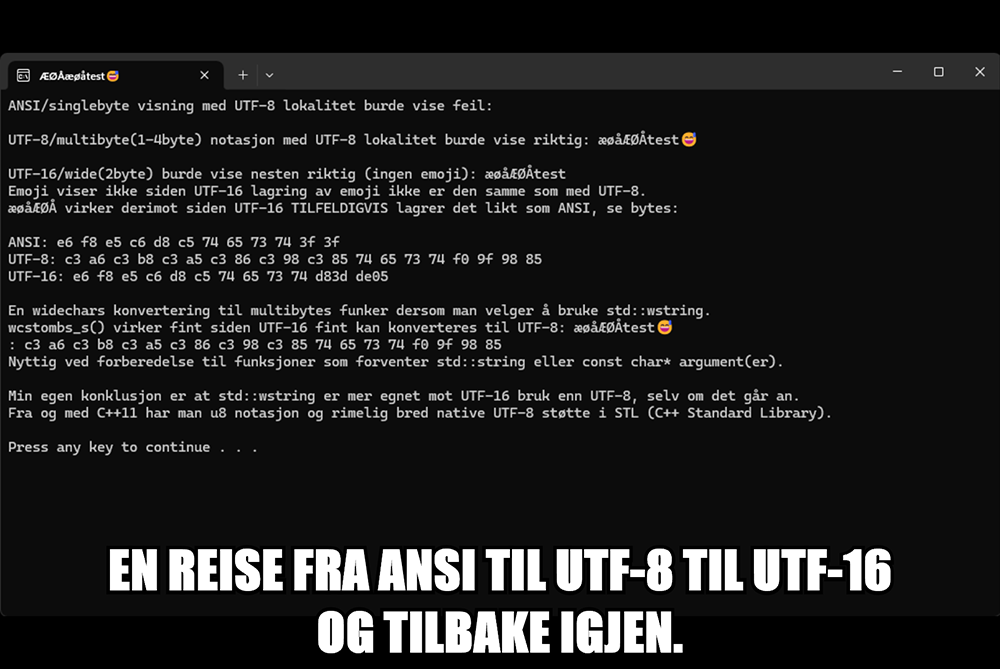

## æøåÆØÅtest😅

 

Bare litt kode iht. norske tegn i windows terminal og evt. gode gamle conhost/cmd.

Jeg har ofte brukt std::wstring som bruker wchar_t (2-byte per tegn i Windows) fordi det 
funket med æøåÆØÅ nesten av seg selv. Det var mer en tilfeldighet enn intensjon bare pga. 
hvordan f.eks. 0x00e6(æ) blir tolket på samme måte som 0xe6 og som blir gyldig pga. 
ANSI bakoverstøtte i UTF-8. Dette gjelder alle æøåÆØÅ og resten av det norske alfabetet 
er allerede i ASCII settet. 

Jeg har visst om u8"" notasjonen en stund, men en vane er av og til vond å vende. 
Det gjør forsåvidt ingenting så lenge man har henholdsvis kontroll i forhold til 
samhandling mellom egen og andres kode. Det er likevel ikke å stikke under et teppe 
at det er mer tungvindt enn å bare bruke std::string og u8 med c++11 og senere versjoner.

Husk også lagring av selve filer i 65001 som inneholder UTF-8 tegn. 

BOM (Byte Order Mark) er ikke alltid nødvendig, men det finner man ofte fort ut og har 
kun med tolkeren å gjøre som ofte er smart nok til å oppdage innhold som UTF-8 på egenhånd.